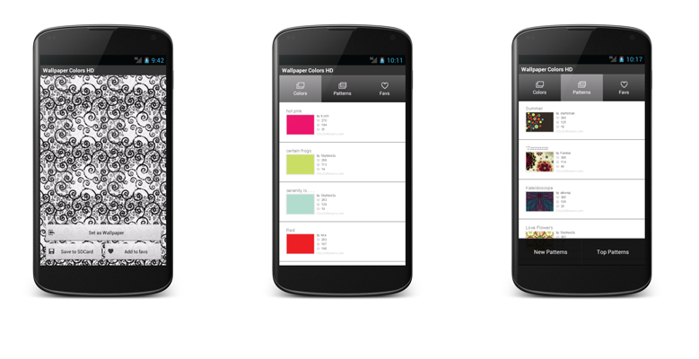

# Wallpaper Patterns

An Android app for setting a colour or pattern from [COLOURlovers](https://www.colourlovers.com) as the device wallpaper.

## Features

- Browse patterns from colourlovers.com and set one as wallpaper
- Browse colours from COLOURlovers and set one as wallpaper
- Save colours or patterns as favourites

## Requirements

| | |
| --- | --- |
| **Min SDK** | API 8 (Android 2.2 Froyo) |
| **Target SDK** | API 13 (Android 3.2 Honeycomb) |
| **Language** | Java |
| **Build** | Eclipse ADT / Apache Ant (`project.properties`) |
| **Package** | `com.squidzoo.wallpaperColors` |
| **Version** | 1.2 (`versionCode` 2) |

Permissions: `INTERNET`, `ACCESS_NETWORK_STATE`, `SET_WALLPAPER`, `WRITE_EXTERNAL_STORAGE`.

Third-party libraries (in `lib/`): Universal Image Loader 1.1.3, Google AdMob Ads SDK 4.3.1.

## Background

Wallpaper Patterns was launched on Google Play in 2012 and open-sourced in May 2013. It is an Eclipse ADT project written in Java and XML with the Android SDK.

## License

Source code is licensed under the [MIT License](LICENSE). Copyright © 2012–2013 Gunnar Karlsson.

Artwork assets (PNG files) are Copyright © Gunnar Karlsson 2012–2013 and are not covered by the MIT License.
